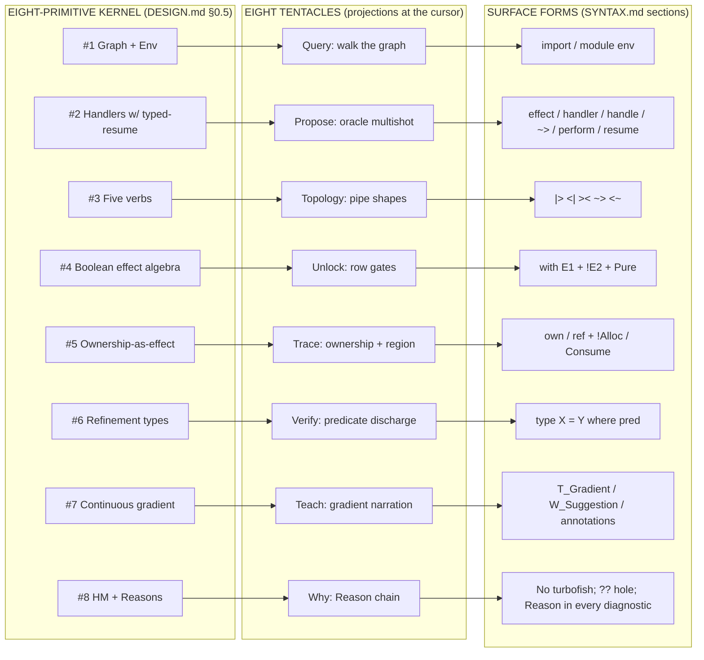
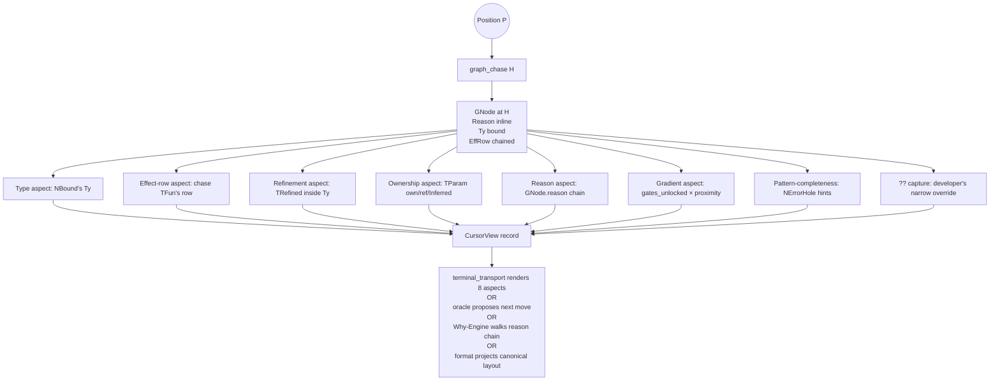
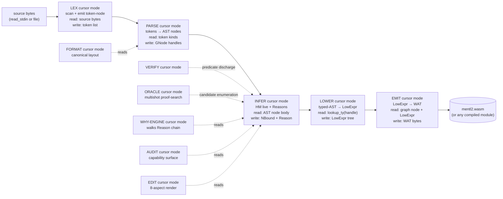
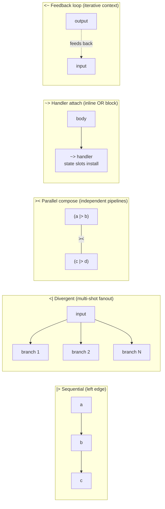
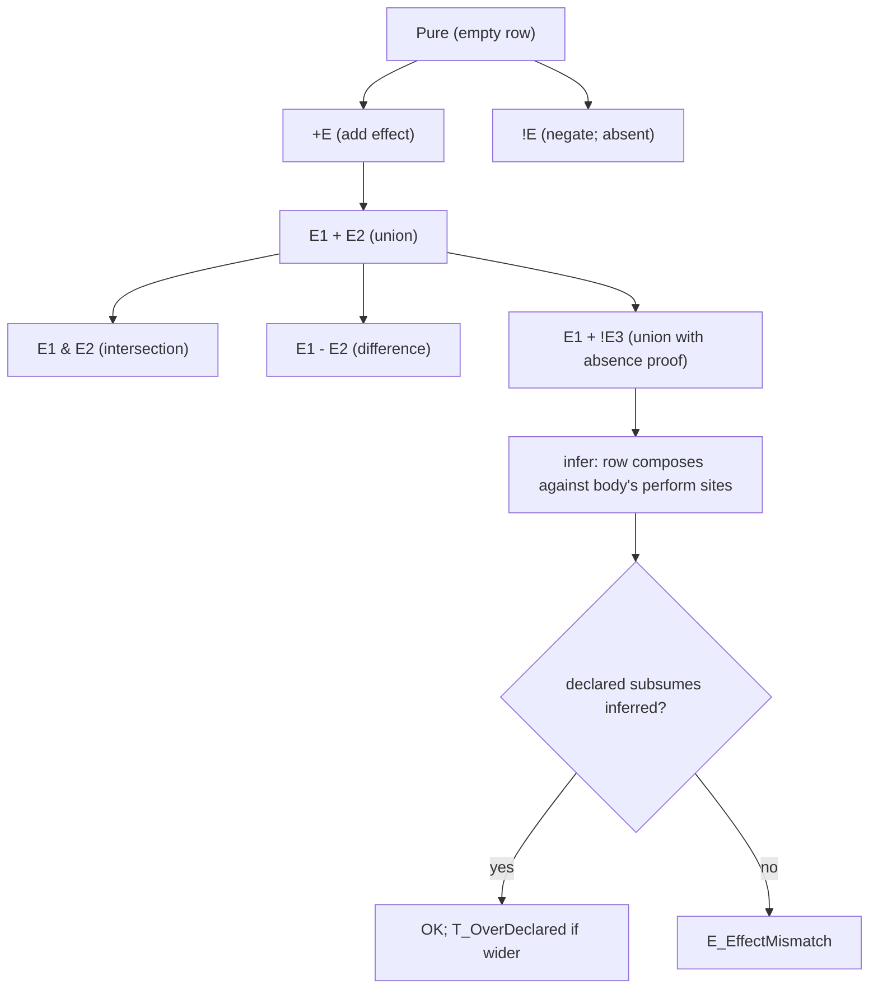
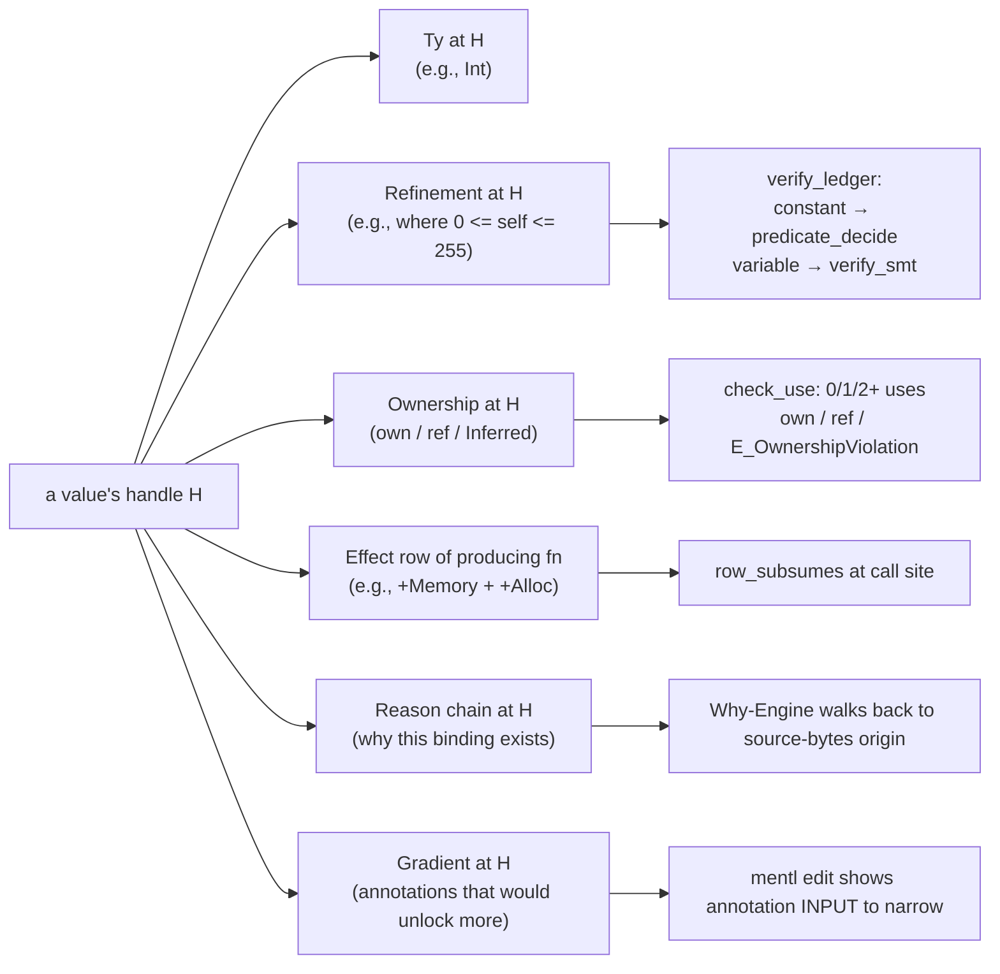
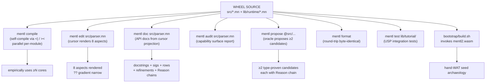

# Mentl — The Ultimate Medium, Projected

> *The medium IS one read at P. This document is that read, projected over the whole.*

This is the visual companion to `docs/ULTIMATE_MEDIUM.md` and `docs/SUBSTRATE.md`. Every box below is a substrate truth; every edge a chase. The diagram IS the medium's own self-representation — the cursor projecting the cursor.

---

## I. The kernel ↔ tentacles ↔ surfaces ring

The eight-primitive kernel surfaces through eight tentacles via canonical syntactic forms. ONE primitive, ONE tentacle, ONE surface group. No drift; no parallel representation.



**Reading:** every surface form on the right is one syntactic form away from the corresponding kernel primitive on the left. No tentacle exists without its kernel ground; no surface form exists without its tentacle. The 1↔1↔1 binding IS the discipline.

---

## II. The cursor's read at one position P

The cursor IS the global argmax — gradient × proximity × stability. At any position P (developer caret OR queued attention), `cursor_default(P)` performs ONE `graph_chase` and projects all eight aspects from that single read. The eight tentacles are not separate computations; they are aspects of one read.



**Reading:** the cursor IS one chase. The eight aspects are projections of the same GNode. `mentl edit` renders them; `mentl propose` enumerates next-position candidates; `mentl query --why H` walks the chain; `mentl format` rewrites to canonical form. ONE substrate, FOUR observers.

---

## III. The compile pipeline as cursor-mode traversals

Each subsystem (lex, parse, infer, lower, emit, verify, oracle) IS the cursor traversing the graph in a specific mode. NOT separate compilers chained sequentially — ONE cursor reading the graph at different layers.



**Reading:** lex/parse/infer/lower/emit are NOT pipeline stages — they are cursor modes. Each reads the graph at its own layer and writes back to the graph. Verify, Oracle, Why-Engine, Format, Audit, Edit are SIBLING modes — they read the same graph (post-infer) for different surfaces. The wheel IS the graph; every observer reads via `graph_chase`.

---

## IV. The five-verb topology

The five verbs DRAW SHAPES on the page; the shape IS the computation graph. Layout is contract.



**Reading:** `|>` ALWAYS at left edge; `<|` at left edge with branch tuple; `><` at INDENTED center between parenthesized pipelines (Form A vertical / Form B inline); `~>` at left edge (block form) or inline-attached; `<~` at INDENTED center.

Per SUBSTRATE.md §II layout convention: sequential operators at left edge — flow goes DOWN; convergent operators at indented center — they DRAW SHAPE.

---

## V. The Boolean effect algebra at the type level

Every signature carries an effect row. The row IS a kernel value (per kernel primitive #4). Row composition is structural — `+ - & ! Pure` are operators on rows.



**Reading:** the row at a signature site is a CONSTRAINT against which the body's `perform` sites are verified. Wider declared row → T_OverDeclared gradient suggestion (narrow to unlock capability). Body performs IO when `!IO` declared → E_PurityViolated.

Capabilities (per the just-landed Capability declarations) ARE rows — `capability File = read + write` is a row alias.

---

## VI. Refinement, ownership, gradient — composing at one type

A single value's type can carry refinement + ownership + Reason simultaneously. The kernel composes them; the cursor projects them at one position.



**Reading:** the eight aspects co-exist on one value. The cursor's read projects ALL eight. The medium NEVER asks "what type?" without also knowing refinement, ownership, row, Reason, gradient. That's the kernel-closure claim.

---

## VII. Mentl utilizes Mentl — the reflexive surface

Mentl IS reflexive — it reads itself, proposes on itself, formats itself, parallelizes on itself. The medium runs on its own substrate. Post-L1 closure (mentl2 == mentl3), every surface verb operates on the wheel's own source.



**Reading:** Mentl utilizes Mentl means each `mentl <verb>` invocation operates on the wheel itself coherently. The medium IS reflexive only when this composes. Post-L1, the cascade unlocks naturally — each surface verb reads the SAME graph the compile pipeline produces.

---

## VIII. The reflexive cascade — Mentl reads Mentl reads Mentl

```mermaid
graph TB
    L1["L1 CLOSURE<br/>(mentl2 == mentl3 byte-identical)"]
    L1 --> Tier3Trans["Tier 3 transcription<br/>(each Phase μ peer's .seed.wat self-compiles)"]
    Tier3Trans --> Multithread["T1.7 multithreading<br/>wheel uses <| / ><"]
    Multithread --> Oracle["T1.1 oracle multishot<br/>parallelized via <|"]
    Oracle --> Cursor["T1.5 cursor projects 8 aspects<br/>during live editing"]
    Cursor --> Reflexive["T1.8 reflexive surface<br/>every USP claim demonstrated<br/>BY the wheel ITSELF"]

    Reflexive --> Surpass[("MENTL IS THE END-ALL-BE-ALL<br/>by empirical demonstration"]

    style Surpass fill:#1a1
```

**Reading:** the cascade is a feedback loop on itself. Each level proves the next. L1 closure proves the kernel compiles itself. Tier-3 transcription proves each module self-compiles. Multithreading proves the wheel's compile uses its own parallelism. Oracle proves the multishot substrate. Cursor proves the eight-aspect projection. Reflexive surface proves it all on real wheel code. Every reduction in compile time IS the wheel's own parallelism substrate proving itself on its own source.

NO other language has this property. Rust's parallel compile isn't written in Rust's effect system; Haskell's `par`/`pseq` isn't compiled by `par`/`pseq` itself. Mentl utilizes Mentl IS the end-of-end-all-be-all.

---

## Cross-references

- `docs/ULTIMATE_MEDIUM.md` — thesis statement and §8 day-in-the-medium
- `docs/SUBSTRATE.md` §I-IX — kernel + verbs + algebra + handlers + gradient + refinement + theorems
- `docs/DESIGN.md` §0.5 — the eight primitives
- `docs/SYNTAX.md` — surface forms per primitive
- `docs/specs/simulations/Hμ-cursor.md` — cursor projection substrate
- `protocol_ultimate_medium.md` — protocol crystallization
- `protocol_cursor_is_argmax.md` — cursor IS attention not text-caret
- `protocol_cursor_is_the_substrate.md` — every subsystem is the cursor in a different mode
